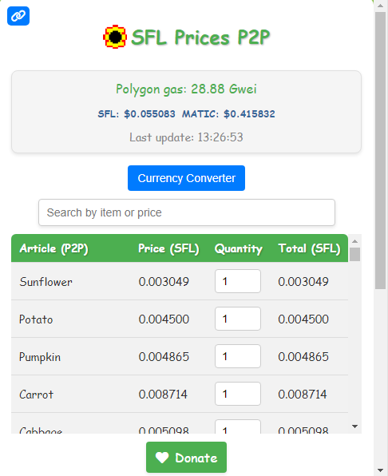

# Contact: josevdr95@gmail.com

# Manual Installation Guide for Chrome Extensions

This guide will show you how to manually install Chrome extensions using uncompressed files. This is useful if you have downloaded an extension in ZIP format or if you are developing your own extension.

## Prerequisites

- Google Chrome installed on your computer.
- The extension files uncompressed in a folder.

## Steps to Install the Extension

1. **Download and Unzip the Extension**
   - If you downloaded the extension in ZIP format, unzip it to a folder of your choice.

2. **Open Google Chrome**
   - Launch Google Chrome on your computer.

3. **Access the Extensions Page**
   - Click on the three dots icon in the upper right corner of Chrome.
   - Select `More tools` > `Extensions`.

4. **Enable Developer Mode**
   - In the upper right corner of the extensions page, toggle the switch that says `Developer mode`.

5. **Load the Uncompressed Extension**
   - Click on the `Load unpacked` button.
   - Navigate to the folder where you unzipped the extension files and select it.
   - Click on `Select Folder`.

6. **Verify the Installation**
   - The extension should now appear in the list of installed extensions. Make sure it is enabled.

## Troubleshooting

- **The extension does not load**: Ensure that the selected folder contains a valid `manifest.json` file.
- **Permission errors**: Check the permissions requested in the `manifest.json` file and ensure they are correct.

## Uninstalling the Extension

If you wish to uninstall the extension:

1. Go to the extensions page (as described above).
2. Find the extension you want to remove.
3. Click the `Remove` button and confirm the action.